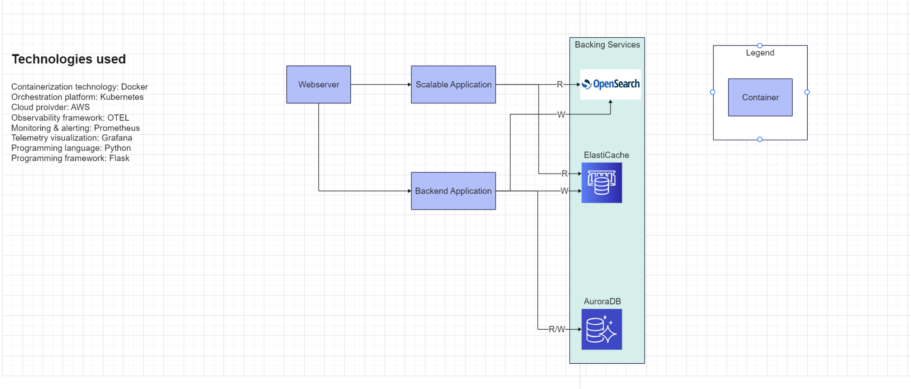

# Sample app
### Intro
This app is solely created to explore a full stack of technologies aimed to create a fully managed cloud native architecture application with extra added levels of complexity to enable to exploration of scalability, maintainability and realiability patterns that enable the aforementioned architecture.

I will keep the documentation up to date with initial architecture decisions that enable the design and implementation of the architecture with the following principles in mind:
- Automation first - No manual creation of resources, application, deployment, scaling, etc. This enhances the need for using containerized applications with a CI/CD pipeline.
- Cloud native - Fully managed backing services to remove the extra hardware knowledge cost that is required to enable the deployment of a complex application on a self-managed data center, provide ability to be flexible with adding/removing services to be able to react well to changing business requirements
- Obervable - Monitoring & alerting is baked into application development and deployment
- Performant - Load testing is part of application development, at least for the heavilty performant part of the system.

The general architecture of the system will look like this:
